# bseverns.github.io

This repo now runs like a stripped-down landing pad for Ben Severns: three pillars (Tools / Scenes / Learning), a press kit with living copy, and a tiny JS layer that only does conditional image checks. Think studio notebook meets teaching guide—every file is here to explain itself.

## Portfolio diagram
<div align="center" style="max-width:800px; overflow-x:auto;">
## Portfolio diagram


</div>


```mermaid
%%{ init: { "flowchart": { "defaultRenderer": "dagre-d3", "rankSpacing": 34, "nodeSpacing": 8 } } }%%
graph TD
    thesis["Empower people to build with agency using open tools,<br>consent-forward scenes,<br>and learning environments — all documented loudly."]

    thesis --> toolsPillar["Tools"]

    %% TOOLS (audio -> control -> analysis), all in one vertical chain
    toolsPillar --> toolsAudio["Tools: sound + patch worlds"]
    toolsAudio --> tmsLib["tms-lib"] --> seedBox["seedBox"] --> Horizon["Horizon"] --> DustPress["DustPress"] --> lofiSampler["lofi-sampler"] --> PdRepo["Pd"] --> VCVpatch["VCV_patch"]

    VCVpatch --> toolsControl["Tools: control + hardware"]
    toolsControl --> MOARkNOBS42["MOARkNOBS-42"] --> MN42Configurator["MN42 configurator"] --> arduinoSketches["arduinoSketches"] --> microGranny2["microGranny2"] --> x0xb0x["x0xb0x"]

    x0xb0x --> toolsAnalysis["Tools: analysis + triggers + DSP"]
    toolsAnalysis --> frZone["frZone_core"] --> teensyDSP["Teensy DSP fx unit"]

    %% SCENES (works -> stage stack), continuing the same vertical chain
    teensyDSP --> scenesPillar["Scenes"]
    scenesPillar --> scenesWorks["Scenes: works + studies"]
    scenesWorks --> perceptualDrift["perceptual-drift"] --> pointyClumps["pointy-clumps"] --> droneChorus["drone-chorus"] --> roomLens["roomLens"] --> StringFieldNode["StringField"] --> DiceLoopNode["DiceLoop"] --> hallwayReactor["hallway-reactor"] --> ArduinoSculpture["ArduinoSculpture_MCAD"] --> HumanBuffer["Human-Buffer"]

    HumanBuffer --> scenesStage["Scenes: stage interop stack"]
    scenesStage --> liveRig["live-rig"] --> liveRigCtrl["live-rig-control"] --> interstream["interstream"] --> maelstrom["maelstrom"] --> scVideoMixer["SC Video Mixer"] --> clipFoundry["new_wrld (clip foundry)"] --> deskCam["desk camera feed"]

    %% LEARNING (curricula -> factory -> docs -> ops), continuing the same chain
    deskCam --> learningPillar["Learning Environments"]
    learningPillar --> learnCurricula["Learning: createMPLS curricula"]
    learnCurricula --> cMCurricula["cM_curricula"] --> scratch["Scratch (12w)"] --> printing["3D print/CAD (4)"] --> lego["LEGO Spike/BricQ"] --> piper["Piper/RPi"] --> dronesEd["Drones curriculum"] --> privacyMedia["Privacy media course"]

    privacyMedia --> learnFactory["Learning: course factory"]
    learnFactory --> SyllabusRepo["Syllabus"] --> ART215["ART215_SP22"]

    ART215 --> learnDocs["Learning: docs + public site"]
    learnDocs --> repairStudio["repair-studio"] --> machineDocs["machine-docs"] --> personalSite["bseverns.github.io"]

    personalSite --> learnOps["Learning: teacher workflow"]
    learnOps --> teacherOps["make → deploy → assess"]

    %% SYSTEMS (LMS -> fleet -> archive -> infra -> governance), continuing the chain
    teacherOps --> infraPillar["Systems & Distribution"]
    infraPillar --> infraLMS["Systems: classroom doorways"]
    infraLMS --> tailoredu["TailorEDU"] --> tailoreduRepo["Tailoredu repo"] --> djangoLMS["LMS redesign (Django)"] --> classhub["selfhosted-classhub"] --> infraStack["Infra stack (PG/Redis/MinIO/Caddy)"]

    infraStack --> infraFleet["Systems: deployment + device fleet"]
    infraFleet --> piImaging["Pi imaging kit"] --> docker["Docker/compose"] --> server["Ubuntu server"] --> openvpn["OpenVPN"]

    openvpn --> infraArchive["Systems: indexing + publishing"]
    infraArchive --> llfs["LlamaFS"] --> studio1["Studio1"] --> ghPages["GitHub Pages"]

    ghPages --> infraLab["Systems: studio infrastructure"]
    infraLab --> homeauto["homeauto"] --> turingpi2["Turing Pi 2"] --> printServer["Repetier-Server node"]

    printServer --> infraGov["Systems: governance + ethics"]
    infraGov --> governance["AGENTS + checklists + consent notes"]

    %% Hubs as a final vertical footer
    governance --> agencyHub["Agency / Authorship / Feedback Loops"] --> opennessHub["Open Documentation & Consent-Forward Ethos"] --> resilienceHub["Field Reliability / Safety / Care"]

    %% STYLES
    classDef tools fill:#383838,stroke:#FFFFFF,stroke-width:2px;
    classDef scenes fill:#D5E8D4,stroke:#82B366,stroke-width:2px;
    classDef learning fill:#BAE8FC,stroke:#6C8EBF,stroke-width:2px;
    classDef infra fill:#E7D7FF,stroke:#7C5CBF,stroke-width:2px;
    classDef hub fill:#F2F2CC,stroke:#999,stroke-width:2px,stroke-dasharray: 3 3;

    class thesis,toolsPillar,toolsAudio,tmsLib,seedBox,Horizon,DustPress,lofiSampler,PdRepo,VCVpatch,toolsControl,MOARkNOBS42,MN42Configurator,arduinoSketches,microGranny2,x0xb0x,toolsAnalysis,frZone,teensyDSP tools;
    class scenesPillar,scenesWorks,perceptualDrift,pointyClumps,droneChorus,roomLens,StringFieldNode,DiceLoopNode,hallwayReactor,ArduinoSculpture,HumanBuffer,scenesStage,liveRig,liveRigCtrl,interstream,maelstrom,scVideoMixer,clipFoundry,deskCam scenes;
    class learningPillar,learnCurricula,cMCurricula,scratch,printing,lego,piper,dronesEd,privacyMedia,learnFactory,SyllabusRepo,ART215,learnDocs,repairStudio,machineDocs,personalSite,learnOps,teacherOps learning;
    class infraPillar,infraLMS,tailoredu,tailoreduRepo,djangoLMS,classhub,infraStack,infraFleet,piImaging,docker,server,openvpn,infraArchive,llfs,studio1,ghPages,infraLab,homeauto,turingpi2,printServer,infraGov,governance infra;
    class agencyHub,opennessHub,resilienceHub hub;
```

## Stack snapshot
- **HTML**: Hand-authored pages at the project root (`index.html`, `art.html`, `courses.html`, `press-kit.html`, `contact.html`, `404.html`). No templates, no includes—what you see is what ships.
- **CSS**: One file, [`/css/site.css`](css/site.css). It handles layout, color systems (light/dark), placeholders, and focus states.
- **JS**: [`/js/site.js`](js/site.js) for conditional image rendering, asset status badges, and footer year updates. [`/js/archive-banner.js`](js/archive-banner.js) exists for legacy pages only.
- **No images baked in**: JavaScript does a `HEAD` request before inserting any ``. Missing files borrow an in-repo fallback photo before dropping to an accessible placeholder block.

## Local dev (pick your flavor)
1. **Quick static preview** (no build step):
   ```bash
   npx serve .
   ```
   or any static web server (`python -m http.server`, `ruby -run -ehttpd . -p 4000`, etc.).
2. **Jekyll folks**: the repo still contains old `_projects/` content. If you need them, run `bundle exec jekyll serve` and everything—including the new flat files—will compile. The new landing doesn’t rely on Jekyll though.

## Content map
| File | Intent |
| --- | --- |
| `index.html` | Hero statement, three-pillar cards, What’s New list, archive note. Edit the list in-place (there’s a reminder comment). |
| `art.html` | Studio starter cards. Swap copy + links as projects solidify. |
| `courses.html` | Teaching starter cards with comment-callouts for pending links. |
| `press-kit.html` | Contains the 100-word and 300-word bios, quick facts, image drop points. JS turns asset paths into ✅ links if files exist. |
| `contact.html` | Email + social routes. Points media back to the press kit. |
| `404.html` | Friendly reroute to the main sections. |
| `robots.txt` & `sitemap.xml` | Pre-baked for search engines; update `lastmod` dates when you ship meaningful changes. |

## Working with images (without shipping new ones)
- Drop files at the listed paths (`/img/press/headshot.jpg`, `/img/social/og-banner.jpg`, etc.) and refresh—JS will surface them.
- If a path stays empty, the placeholder announces itself via `aria-label="… (placeholder)"` so screen readers know what’s happening.
- Want different art on a card? Update the `data-src` and `data-alt` attributes and the script does the rest.
- The loader now waits for actual image load events (instead of fragile `HEAD` checks), so you’ll either see the image, the documented fallback, or a loud placeholder—no more silent failures.

## Archiving the old site (optional but handy)
Legacy HTML still lives throughout this repo. To tack on the new archive banner + canonical link automatically:
```bash
node tools/attach-archive-banner.js
```
The script walks every `.html` file outside the new set and injects:
- `<script src="/js/archive-banner.js" defer></script>` before `</body>`
- `<link rel="canonical" href="https://bseverns.github.io/">` in `<head>` if it’s missing
It’s idempotent—run it as often as you like.

## Editing rituals
- **What’s New**: keep three bullets live; swap them as projects shift. The inline comment in `index.html` is your reminder.
- **Cards**: each card has a `data-src` and `data-alt`. Leave them empty rather than pointing at non-existent media.
- **Press kit copy**: treat it like source-of-truth text. Update bios here first; elsewhere should link back.
- **Accessibility + SEO**: titles, descriptions, JSON-LD, and Open Graph tags are all hard-coded per page. Keep descriptions under ~160 chars when you edit.

## Testing checklist
- Load pages in a browser with DevTools open—watch the network tab for `HEAD` requests only (no `GET` on missing images).
- Tab through everything to confirm focus rings stay visible.
- Run Lighthouse (desktop) and aim for 95+ across the board. The lightweight stack makes that achievable without extra tuning.

## License
Content: [CC BY-SA 4.0](https://creativecommons.org/licenses/by-sa/4.0/)

Built for curiosity, remixing, and the kind of documentation that lets other people build faster.
