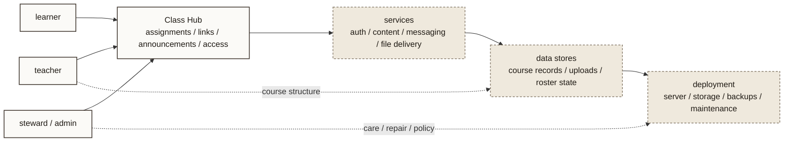

# Class Hub Architecture

- Purpose: map the relationship between roles, the Class Hub application layer, supporting services, stored course data, and deployment.
- Suggested site placement: `courses.html`, `/atlas/`, or source-only until the public Class Hub story is fuller
- Level: `project-level`
- Status: `source draft`

