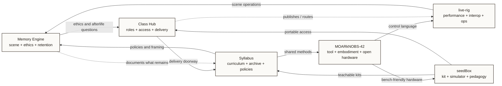

# Core Project Relationships

- Purpose: show how the six core projects feed one another as a fleet instead of standing alone.
- Suggested site placement: `index.html` or `/atlas/`
- Level: `homepage-level`
- Status: `source draft`

