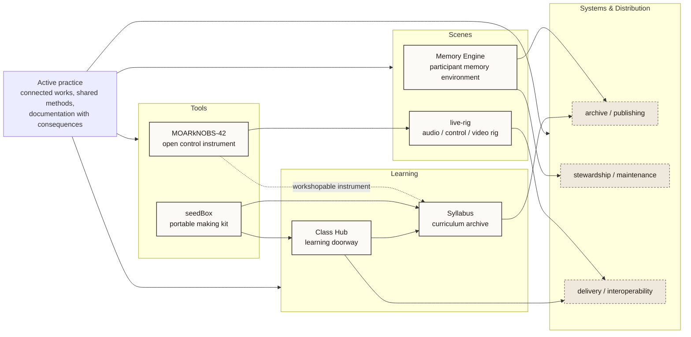

# Fleet Map

- Purpose: show the operating structure of the practice across tools, scenes, learning, and systems/distribution.
- Suggested site placement: `index.html`
- Level: `homepage-level`
- Status: `source draft`

