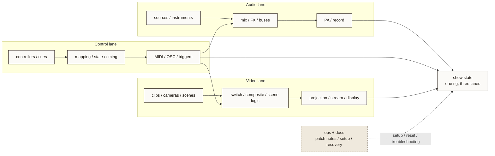

# live-rig Topology

- Purpose: explain live-rig as three coordinated lanes rather than a single opaque performance stack.
- Suggested site placement: `art.html` or a future live-rig detail page
- Level: `project-level`
- Status: `source draft`

