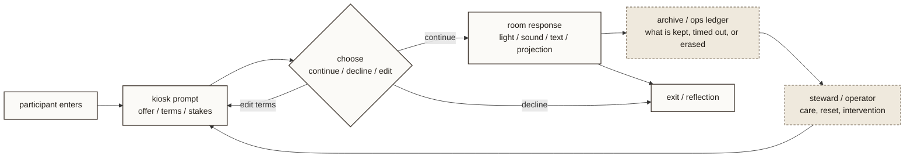

# Memory Engine Flow

- Purpose: explain the participant path through Memory Engine and make the choice / room / archive logic explicit.
- Suggested site placement: `art.html` or a future Memory Engine detail page
- Level: `project-level`
- Status: `source draft`

