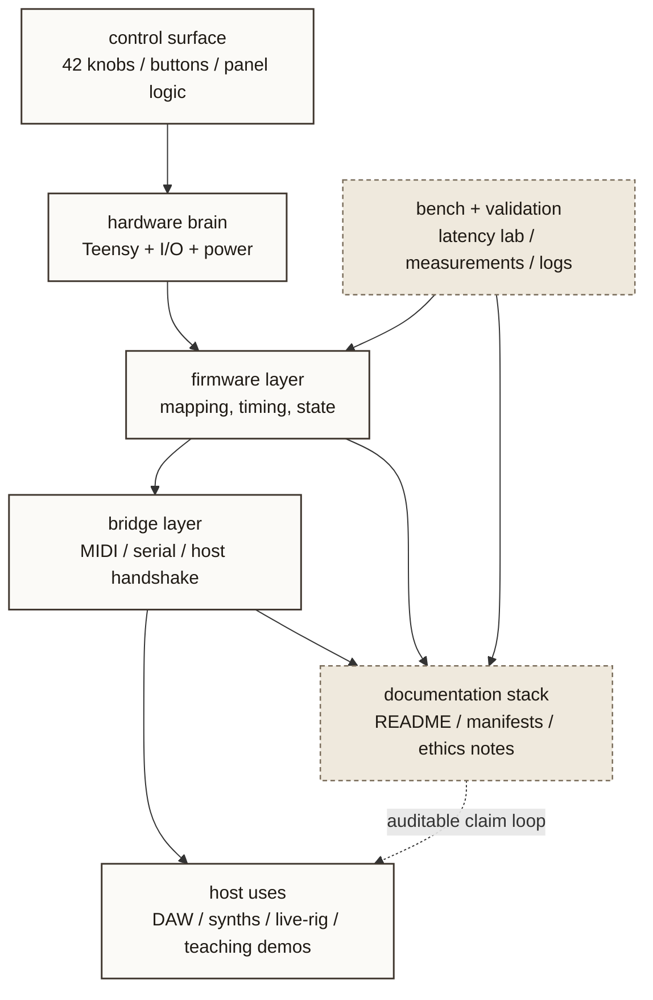

# MOARkNOBS-42 Stack

- Purpose: show MOARkNOBS-42 as a stack of physical interface, firmware logic, bridge behavior, host use, and public documentation.
- Suggested site placement: `art.html`, `/atlas/`, or a future MN42 detail page
- Level: `project-level`
- Status: `source draft`

