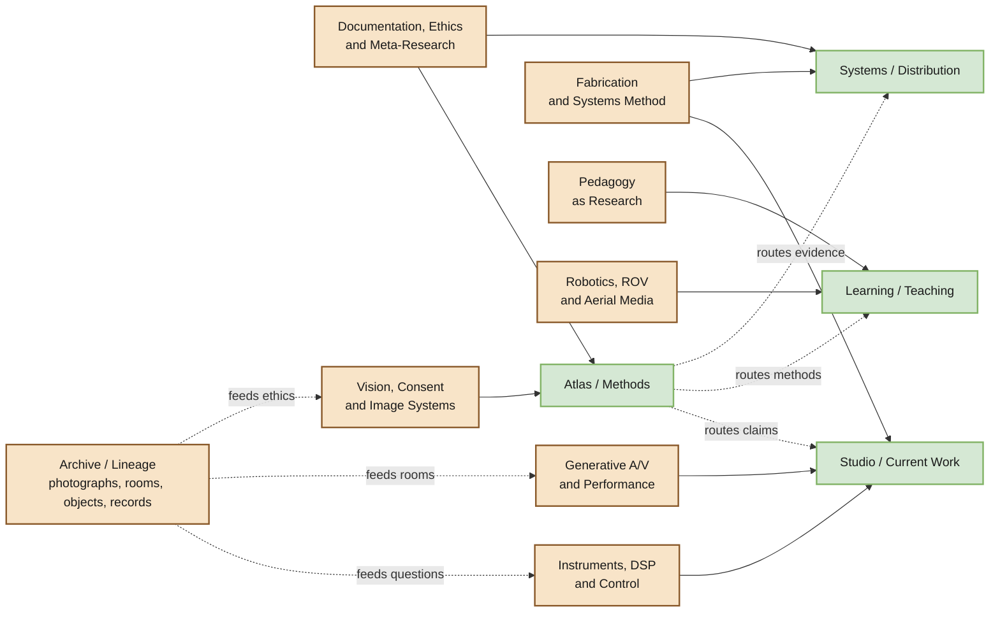

# Research Node Orbit

```mermaid
flowchart LR
    archive["Archive / Lineage<br>photographs, rooms, objects, records"]
    ethics["Documentation, Ethics<br>and Meta-Research"]
    instruments["Instruments, DSP<br>and Control"]
    vision["Vision, Consent<br>and Image Systems"]
    fabrication["Fabrication<br>and Systems Method"]
    pedagogy["Pedagogy<br>as Research"]
    robotics["Robotics, ROV<br>and Aerial Media"]
    av["Generative A/V<br>and Performance"]

    studio["Studio / Current Work"]
    teaching["Learning / Teaching"]
    systems["Systems / Distribution"]
    atlas["Atlas / Methods"]

    archive -. "feeds questions" .-> instruments
    archive -. "feeds rooms" .-> av
    archive -. "feeds ethics" .-> vision

    instruments --> studio
    av --> studio
    fabrication --> studio
    vision --> atlas
    ethics --> atlas
    pedagogy --> teaching
    robotics --> teaching
    fabrication --> systems
    ethics --> systems

    atlas -. "routes claims" .-> studio
    atlas -. "routes methods" .-> teaching
    atlas -. "routes evidence" .-> systems

    classDef research fill:#f8e4c8,stroke:#8a5a2b,stroke-width:2px,color:#1a1a1a;
    classDef public fill:#d5e8d4,stroke:#82b366,stroke-width:2px,color:#1a1a1a;
    class archive,ethics,instruments,vision,fabrication,pedagogy,robotics,av research;
    class studio,teaching,systems,atlas public;
```
