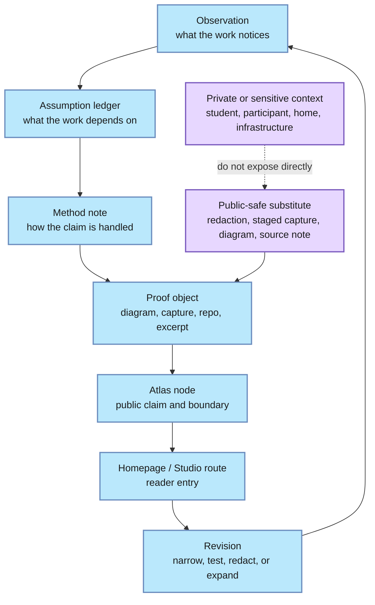

# Research Proof Loop

```mermaid
flowchart TD
    observation["Observation<br>what the work notices"]
    assumption["Assumption ledger<br>what the work depends on"]
    method["Method note<br>how the claim is handled"]
    proof["Proof object<br>diagram, capture, repo, excerpt"]
    node["Atlas node<br>public claim and boundary"]
    route["Homepage / Studio route<br>reader entry"]
    revision["Revision<br>narrow, test, redact, or expand"]

    observation --> assumption
    assumption --> method
    method --> proof
    proof --> node
    node --> route
    route --> revision
    revision --> observation

    private["Private or sensitive context<br>student, participant, home, infrastructure"]
    publicSafe["Public-safe substitute<br>redaction, staged capture, diagram, source note"]

    private -. "do not expose directly" .-> publicSafe
    publicSafe --> proof

    classDef loop fill:#bae8fc,stroke:#6c8ebf,stroke-width:2px,color:#1a1a1a;
    classDef boundary fill:#e7d7ff,stroke:#7c5cbf,stroke-width:2px,color:#1a1a1a;
    class observation,assumption,method,proof,node,route,revision loop;
    class private,publicSafe boundary;
```
