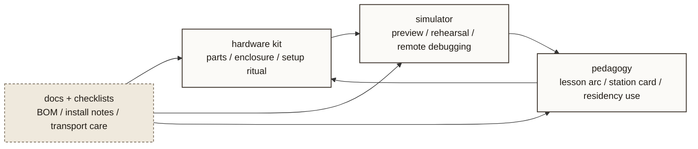

# seedBox Triangle

- Purpose: show seedBox as a bridge between physical kit, simulated rehearsal, and teachable delivery.
- Suggested site placement: `courses.html` or `/atlas/`
- Level: `project-level`
- Status: `source draft`

