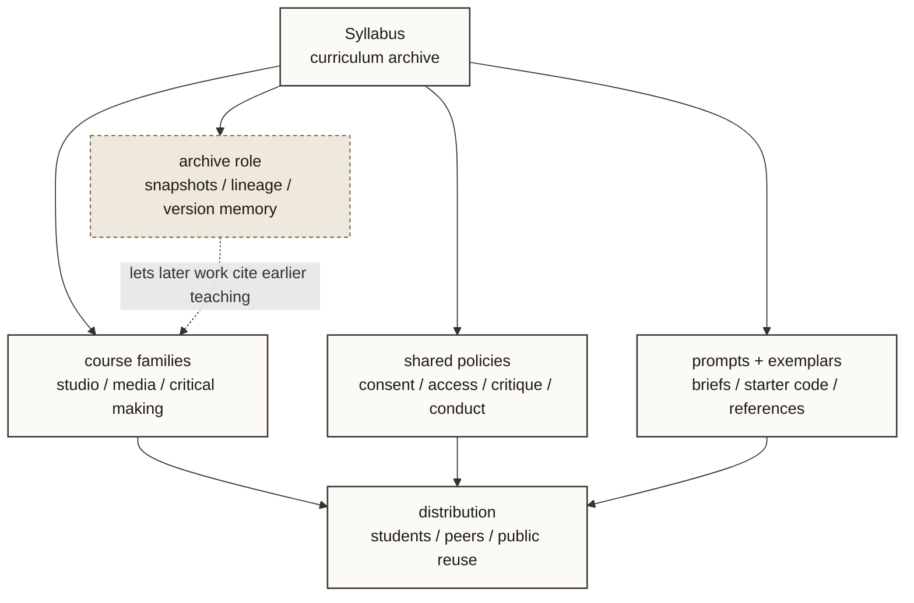

# Syllabus Constellation

- Purpose: frame Syllabus as both a teaching tool and an archive that connects courses, policies, prompts, and public reuse.
- Suggested site placement: `courses.html`
- Level: `project-level`
- Status: `source draft`

